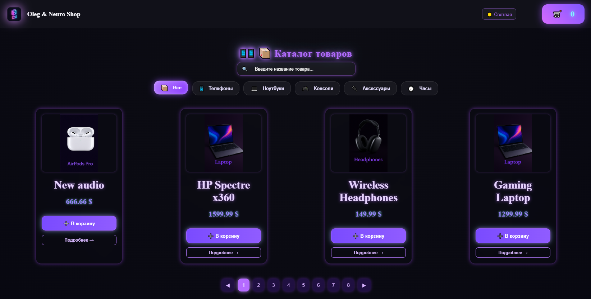
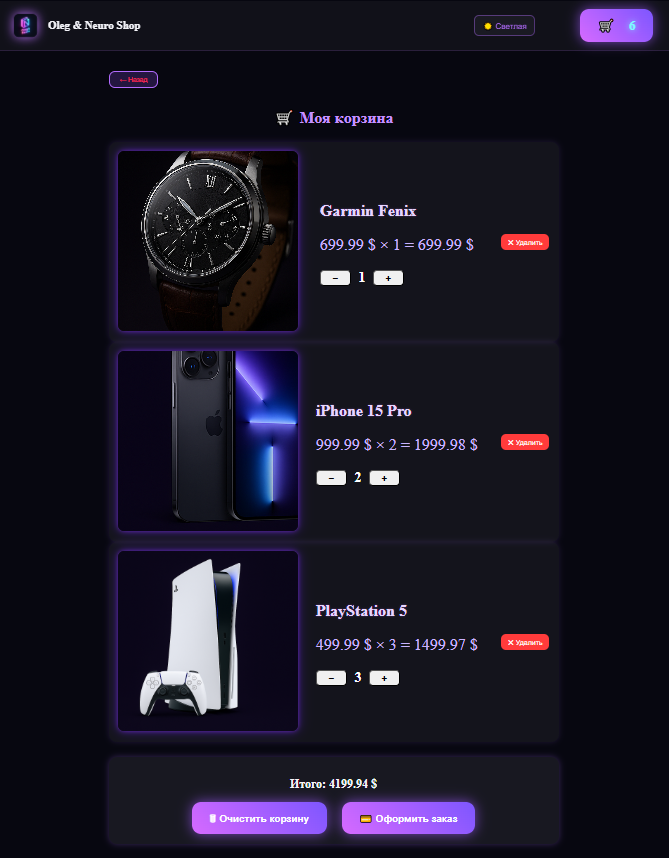
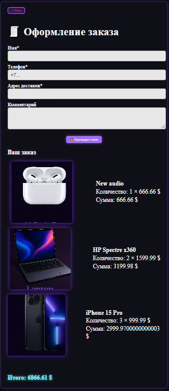
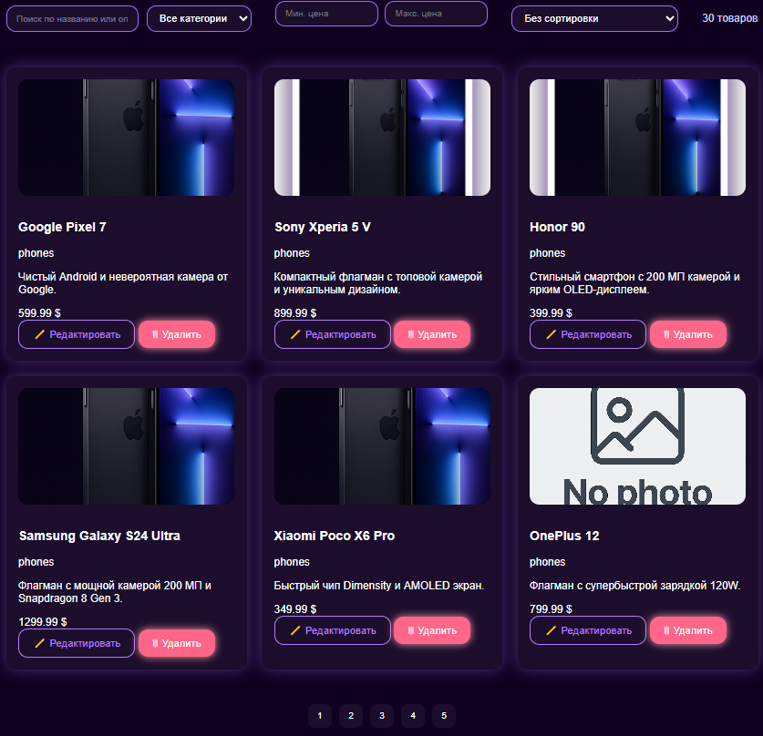

  🌍 <strong>Languages:</strong>  

  

  

 

 

  

  <!-- Frontend -->
  
  
  

  

  <!-- Backend -->
  
  

  

  <!-- Database -->
  

  

  <!-- Tools -->
  
  
  

  

  <!-- Dev tools -->
  
  

 

 

 

<h1 align="center">🛒 Shop.Project — Fullstack Online Store</h1>

Полноценный <b>fullstack-проект интернет-магазина</b> с клиентской частью, админ-панелью и backend API. 
Реализован реальный e-commerce цикл: 
<b>каталог → корзина → оформление заказа → сохранение в БД</b>

 

 

<h2>🚀 Возможности проекта</h2>

<h3>🛍 Клиент (shop-client)</h3>
<ul>
  <li>Каталог товаров по категориям</li>
  <li>Страница товара</li>
  <li>Добавление в корзину</li>
  <li>Управление количеством товара (− / +)</li>
  <li>Пересчёт стоимости в реальном времени</li>
  <li>Корзина с сохранением в localStorage</li>
  <li>Checkout</li>
  <li>Страница «Спасибо за заказ»</li>
</ul>

 

 

<h3>🧾 Оформление заказа</h3>
<ul>
  <li>Имя и телефон клиента</li>
  <li>Комментарий к заказу</li>
  <li>Список товаров с quantity</li>
  <li>Подсчёт общей суммы</li>
  <li>Отправка заказа в API</li>
  <li>Получение номера заказа</li>
</ul>

 

 

<h3>🧑‍💼 Админка (shop-admin)</h3>
<ul>
  <li>Авторизация администратора</li>
  <li>Добавление / редактирование / удаление товаров</li>
  <li>Загрузка изображений</li>
  <li>Категории</li>
  <li>Несколько изображений товара</li>
</ul>

 

 

<h3>⚙ Backend / API (shop-api)</h3>
<ul>
  <li>Express REST API</li>
  <li>Подключение к MySQL</li>
  <li>CRUD товаров</li>
  <li>Оформление заказов</li>
  <li>Генерация orderId</li>
  <li>Статусы заказов</li>
</ul>

 

 

<h2>📸 Screenshots</h2>

  <!-- Catalog -->
  
    

  <!-- Cart -->
  
    

  <!-- Checkout -->
  
    

  <!-- Admin list -->
  
    

  <!-- Admin edit -->
  

<h2>🗄 База данных (MySQL)</h2>

<ul>
  <li>id (AUTO_INCREMENT)</li>
  <li>customer_name</li>
  <li>customer_phone</li>
  <li>comment</li>
  <li>total_price</li>
  <li>status</li>
  <li>created_at</li>
  <li>items (JSON)</li>
</ul>

 

 

<h2>🧱 Архитектура проекта</h2>

<pre>
Shop.Project/
├── shop-client/
├── shop-admin/
├── shop-api/
├── shop-server/
├── uploads/
├── assets/
└── README.md
</pre>

 

 

<h2>🧰 Технологии</h2>

<ul>
  <li>Frontend: React, TypeScript, Vite</li>
  <li>Backend: Node.js, Express</li>
  <li>Database: MySQL</li>
  <li>State: localStorage</li>
  <li>Tools: dotenv, multer, concurrently</li>
</ul>

 

 

<h2>▶ Запуск проекта</h2>

<pre>
npm install
npm run dev
</pre>

<ul>
  <li>Client: http://localhost:5173</li>
  <li>Admin: http://localhost:5174</li>
  <li>API: http://localhost:3000</li>
  <li>Server: http://localhost:4000</li>
</ul>

 

 

<h2>📌 Статус проекта</h2>

🟢 Проект стабилен и полностью рабочий

<ul>
  <li>Order items</li>
  <li>Авторизация</li>
  <li>История заказов</li>
  <li>Деплой</li>
</ul>

 

 

<h2>👤 Автор</h2>

<b>Oleg Martyanov & Neuro</b> Fullstack Developer

 

 

  
  

    Created by <b>Oleg & Neuro Code Studio</b> 💜 
    Logic • Code • Neon
  

